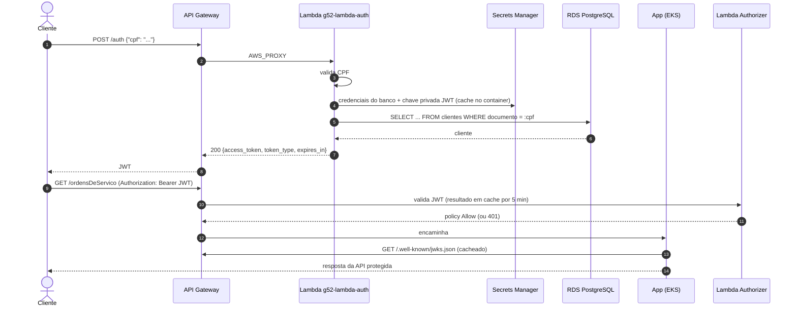

# g52-lambda-tech-challenge

Function Serverless (AWS Lambda, Python 3.12) de **autenticação por CPF** do Tech Challenge — Grupo 52.

A função:

1. **Valida o CPF** informado (formato e dígitos verificadores);
2. **Consulta o cliente** na tabela `clientes` do PostgreSQL gerenciado (existência e status);
3. **Gera e devolve um JWT** (RS256) para consumo das APIs protegidas da aplicação principal.

A chave pública de validação do token é publicada em formato **JWKS**. Assim, a aplicação Spring Boot valida os tokens sem compartilhar segredos.

O mesmo pacote também traz o **Lambda Authorizer** (`authorizer.lambda_handler`). É uma segunda função, do tipo TOKEN, que o API Gateway chama antes de encaminhar as rotas protegidas: ela valida a assinatura, a expiração, o emissor e a audiência do JWT e responde `401` quando o token for inválido.

## Arquitetura



```
                      ┌──────────────── VPC ────────────────┐
API Gateway ──invoke──▶ Lambda (python3.12) ──5432──▶ RDS   │
                      │      │                              │
                      └──────┼──────────────────────────────┘
                             └──HTTPS──▶ Secrets Manager (jwt-signing-key, credenciais do RDS)
                             └─────────▶ CloudWatch Logs (JSON estruturado)
```

## Contrato

### `POST /auth`

```json
{ "cpf": "555.632.710-64" }
```

| Status | Quando | Corpo |
|---|---|---|
| `200` | Cliente encontrado e habilitado | `{"access_token": "<jwt>", "token_type": "Bearer", "expires_in": 3600}` |
| `400` | Corpo inválido ou CPF inválido | `{"message": "CPF inválido", "exceptionType": "BadRequest"}` |
| `401` | CPF não cadastrado | `{"message": "Cliente não encontrado", "exceptionType": "Unauthorized"}` |
| `403` | Cliente não habilitado para autenticar por CPF (`tipo_documento` ≠ `CPF`) | `{"message": "...", "exceptionType": "Forbidden"}` |
| `503` | Banco indisponível ou não configurado | `{"message": "...", "exceptionType": "ServiceUnavailable"}` |

Os erros seguem o `ErrorMessage` do contrato da API (`g52-api-tech-challenge-v1-ext`).

Claims do token:

| Claim | Valor |
|---|---|
| `sub` | id do cliente |
| `cpf` | CPF (somente dígitos) |
| `name` | nome social (ou nome) |
| `email` | e-mail do cliente |
| `roles` | `["CLIENTE"]` |
| `iss` / `aud` | `g52-lambda-auth` / `tech-challenge-api` (configuráveis) |
| `iat` / `nbf` / `exp` | emissão e expiração (padrão: 1h) |

O header do token traz o `kid` (thumbprint RFC 7638 da chave pública).

### `GET /.well-known/jwks.json`

Retorna a chave pública RS256 (`{"keys": [{"kty": "RSA", "kid": "...", "n": "...", "e": "AQAB", ...}]}`).

### Correlation ID

Se o header `x-correlationid` vier na requisição, ele é propagado. Caso contrário, a função gera um. O valor volta no header de resposta e aparece em todos os logs, que são JSON estruturado com o CPF mascarado.

## Tecnologias

- Python 3.12 (AWS Lambda), `pg8000` (driver PostgreSQL puro Python), `PyJWT` + `cryptography`
- AWS Lambda, Secrets Manager, CloudWatch Logs, IAM, VPC
- Terraform (state no S3 `g52-terraform-state-dev-<account>`)
- GitHub Actions com OIDC (role `github-actions-terraform-dev`)

## Estrutura

```
src/
  handler.py          # entrypoint (handler.lambda_handler) e roteamento
  authorizer.py       # Lambda Authorizer (authorizer.lambda_handler)
  auth/
    cpf.py            # validação de CPF
    service.py        # regras de autenticação
    repository.py     # consulta de clientes no PostgreSQL
    tokens.py         # JWT RS256 + JWKS
    secrets.py        # Secrets Manager com cache
    logger.py         # logs JSON
    http.py           # utilitários de evento/resposta do API Gateway
    config.py         # variáveis de ambiente
tests/                # pytest
scripts/build.sh      # gera ./build (código + dependências linux x86_64)
infra/                # Terraform
```

## Execução local

```bash
python -m venv .venv
. .venv/bin/activate        # Windows: .venv\Scripts\activate
pip install -r requirements-dev.txt
pytest -v
```

Para gerar o pacote da Lambda (o mesmo usado pelo pipeline), rode `sh scripts/build.sh`.

## Infraestrutura (Terraform)

| Recurso | Descrição |
|---|---|
| `aws_lambda_function.auth` | Função `python3.12`, handler `handler.lambda_handler` |
| `tls_private_key.jwt` + `aws_secretsmanager_secret.jwt_signing_key` | Chave RSA 2048 de assinatura do JWT |
| `aws_iam_role.lambda` | Execução básica, acesso à VPC e leitura dos segredos (JWT e banco) |
| `aws_cloudwatch_log_group.lambda` | Logs com retenção configurável |
| `aws_security_group.lambda` | SG da função, para liberar no SG do RDS (quando estiver na VPC) |
| `aws_vpc_endpoint.secretsmanager` | Opcional, para subnets sem NAT |
| `aws_lambda_permission.api_gateway` | Permite que o API Gateway invoque a função |
| `aws_lambda_function.authorizer` | `g52-lambda-auth-authorizer`, handler `authorizer.lambda_handler`, recebe a chave pública por variável de ambiente (sem acesso a segredos ou ao banco, fora da VPC) |
| `aws_iam_role.authorizer` | Somente execução básica (logs) |

### Variáveis (`infra/inventories/dev/terraform.tfvars`)

| Variável | Descrição |
|---|---|
| `function_name` | Nome da função; também compõe a key do state |
| `db_host`, `db_port`, `db_name` | Endpoint do RDS (outputs do repositório de infra do banco) |
| `db_secret_arn` | Segredo com `{"username", "password"}`, no formato do RDS managed master password |
| `db_ssl` | Conexão TLS verificada com o CA bundle do RDS (incluído no pacote pelo build) |
| `vpc_id`, `subnet_ids` | Subnets privadas da VPC do RDS. Se ficar vazio, a função roda fora da VPC |
| `create_secretsmanager_endpoint` | Cria VPC endpoint do Secrets Manager quando as subnets não têm saída para a internet |
| `jwt_issuer`, `jwt_audience`, `jwt_ttl_seconds` | Parâmetros do token |
| `destroy` | `true` faz o pipeline executar `terraform destroy` |

Enquanto `db_host` e `db_secret_arn` estiverem vazios, `/.well-known/jwks.json` funciona e `/auth` responde `503`.

### Outputs

| Output | Uso |
|---|---|
| `invoke_arn` | Integração `AWS_PROXY` no API Gateway (`POST /auth`, `GET /.well-known/jwks.json`) |
| `function_name` / `function_arn` | Referência da função |
| `jwt_signing_key_secret_arn` | Segredo da chave privada |
| `security_group_id` | Liberar ingress 5432 no SG do RDS |
| `authorizer_function_name` / `authorizer_invoke_arn` | Authorizer referenciado no `securitySchemes` do contrato OpenAPI |

## Pipeline CI/CD

```
feature/** -> develop -> release/vX.X.X -> main
```

| Workflow | Gatilho | Ação |
|---|---|---|
| `1-feature-to-dev.yml` | Push em `feature/**` | Abre PR automático para `develop` |
| `2-dev-to-release.yml` | Push/PR em `develop` | Testes (pytest), build do pacote, `terraform plan` (PR) ou `apply/destroy` (push), smoke test do JWKS; cria branch e PR `release/vX.X.X` |
| `4-release-to-main.yml` | PR fechado em `release/**` | Abre PR automático da release para `main` |

A autenticação com a AWS é feita via **OIDC** com o role `github-actions-terraform-dev`. A única configuração do repositório é a variável `AWS_ACCOUNT_ID`.

## Testando o deploy

```bash
aws lambda invoke --function-name g52-lambda-auth \
  --cli-binary-format raw-in-base64-out \
  --payload '{"httpMethod":"POST","path":"/auth","headers":{},"body":"{\"cpf\":\"55563271064\"}"}' \
  response.json && cat response.json
```
